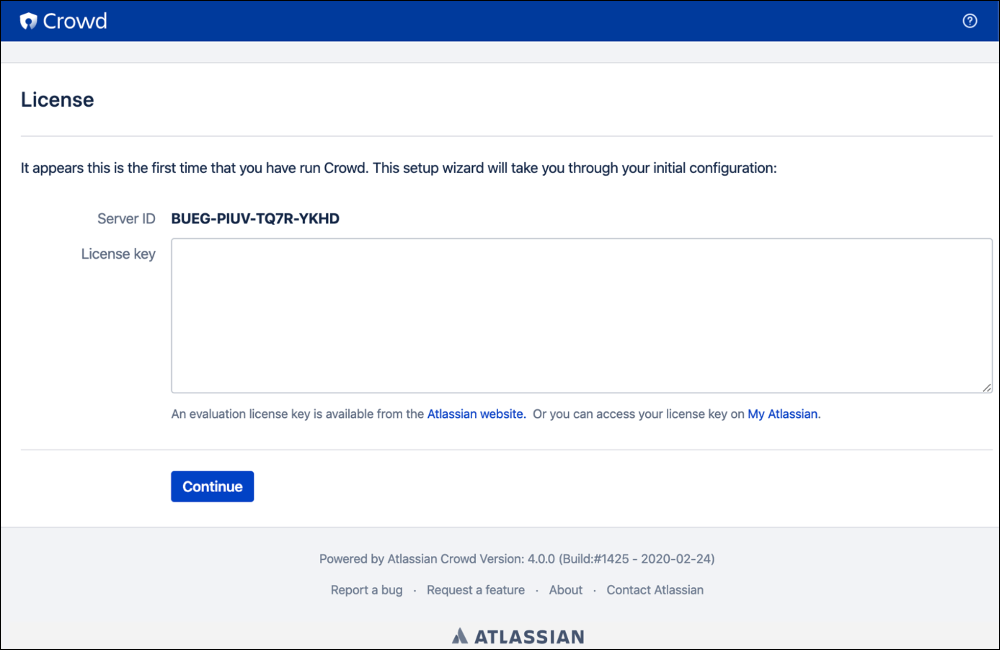
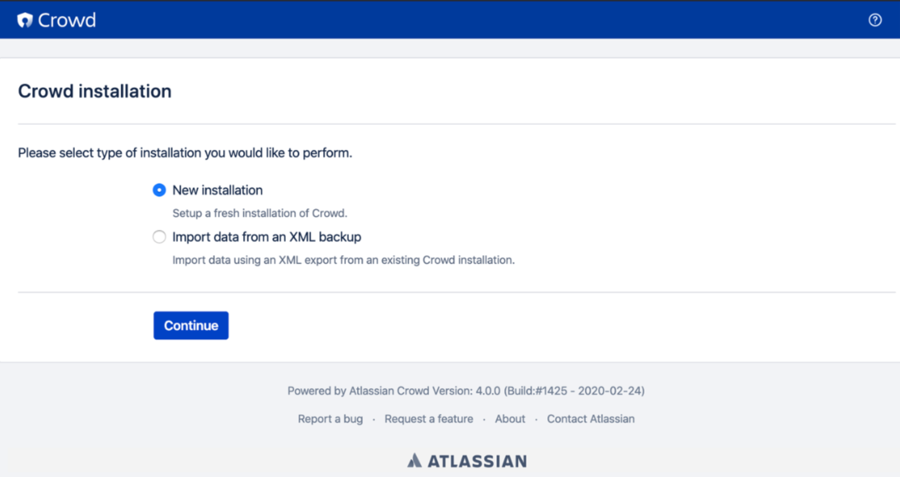
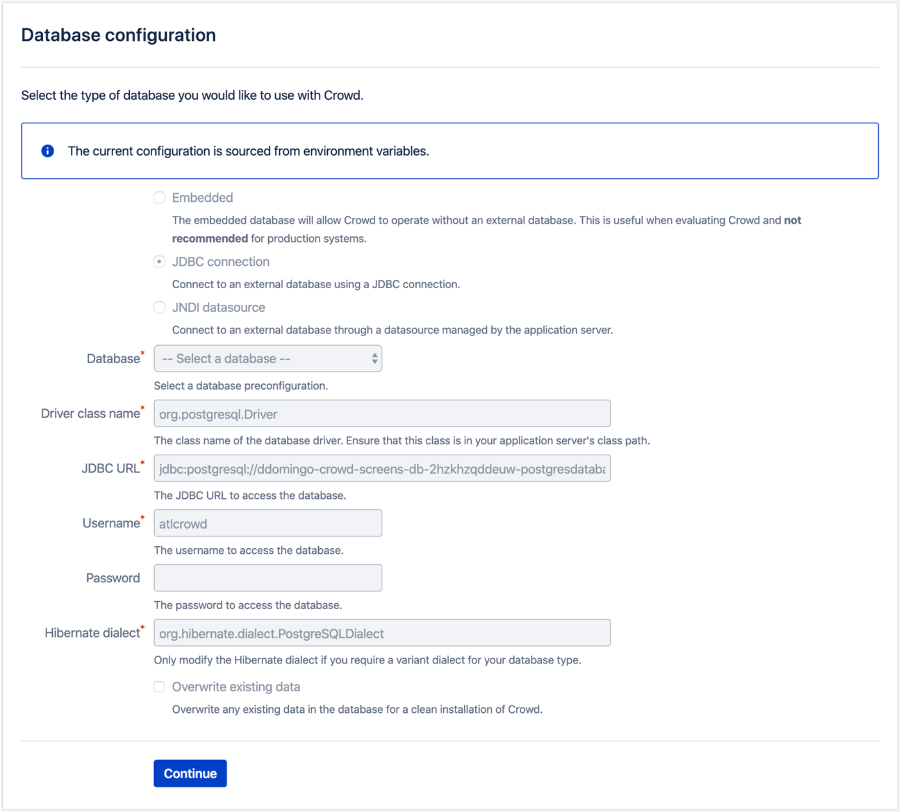
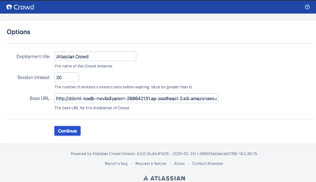
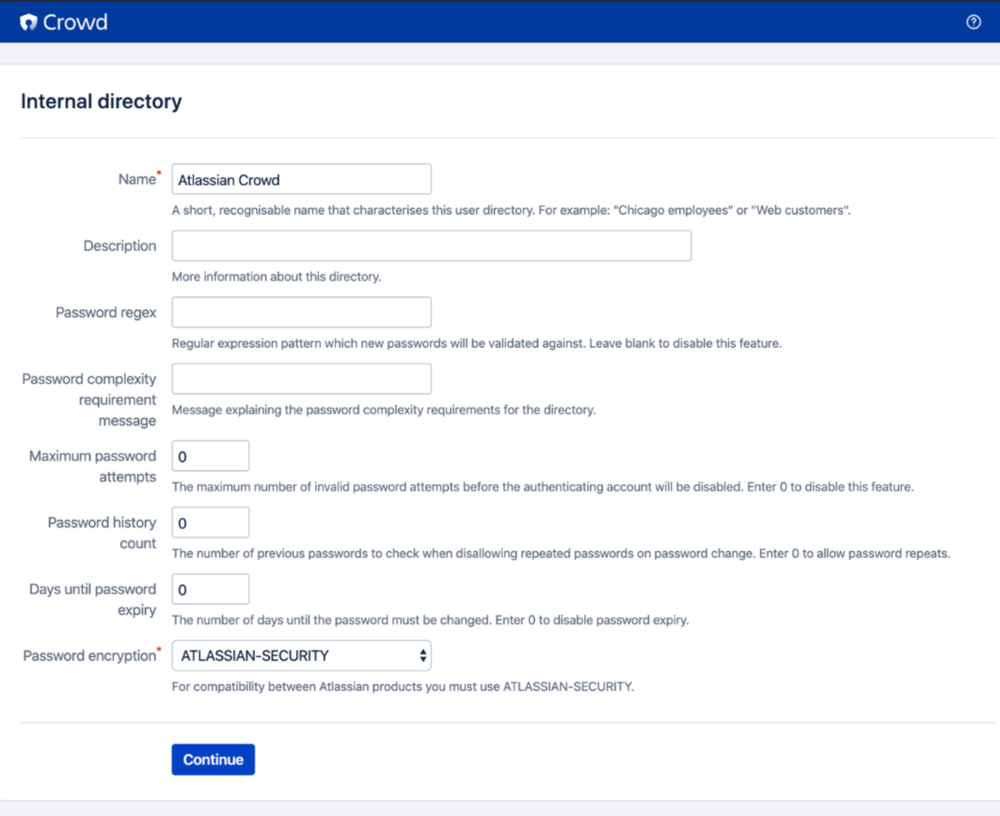
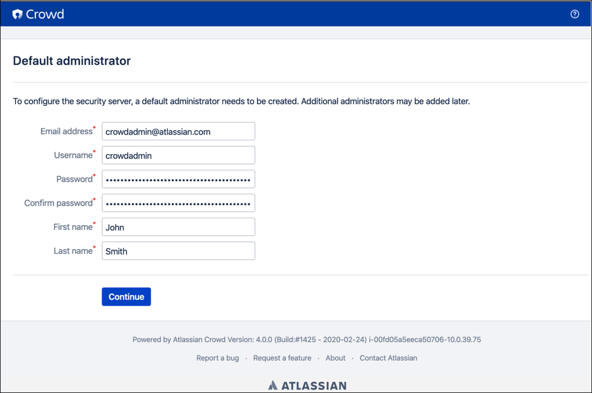
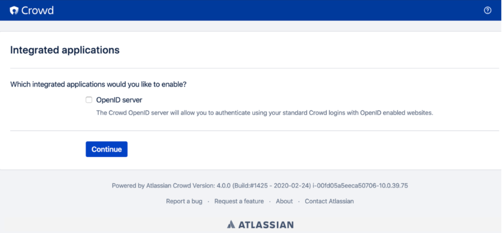
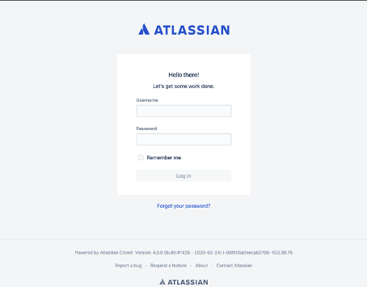

. Choose the URL displayed in the Outputs tab of the AWS CloudFormation stack to go to the {partner-product-name-short} setup screen.
+
IMPORTANT: If you get an https://confluence.atlassian.com/kb/network-and-connectivity-troubleshooting-guide-720405335.html[HTTP Error 503] response when you access the URL, it means that {partner-product-name} is still loading. This is expected, and you should wait 2-3 minutes before trying again.
. On the License page, enter a valid {partner-product-name} license key. If you don’t have a valid license, click on the https://my.atlassian.com/products/index[My Atlassian] link and sign up for an evaluation Data Center license (you’ll be required to log in to your Atlassian account).
+

.	On the Crowd installation screen, select New installation to continue setting up a new Crowd Data Center deployment.
+

+
NOTE: From this screen, you can also select *Import data from an XML backup* to migrate data from an existing Crowd deployment. See https://confluence.atlassian.com/x/DAvoE[Migrating Crowd Between Servers] for more information. The rest of this procedure will focus on configuring a new Crowd Data Center installation.
. The *Database configuration* page will already contain all the required settings to connect to the database. You won’t be able to edit these settings from this screen. Click *Continue* to proceed.
+

. On the *Options* page, you can edit the name of this {partner-product-name-short} deployment and its session timeout. We recommend that you leave the Base URL unchanged; this setting is imported directly from your AWS deployment.
+

. On the *Internal directory* screen, configure how {partner-product-name-short} should store user, role, and group information. For more information, see https://confluence.atlassian.com/x/X4AbAQ[Configuring an Internal Directory].
+

. Use the *Default administrator* screen to create your first Crowd Administrator account. For more information about this account, see https://confluence.atlassian.com/x/GwEQCQ[Crowd Administrator].
+

. Enable any integrated apps on the Integrated applications screen. You can enable these apps after setup if you wish.
+

. On the login screen, use the credentials you created earlier for in the *Default Administrator* screen.
+

. Choose *Clustering* from the administration console sidebar. You should see one node displayed here. At this point, you can now start adding more nodes to your cluster (if you wish).
+
image::../images/qs-crowd-clustering.png[]
