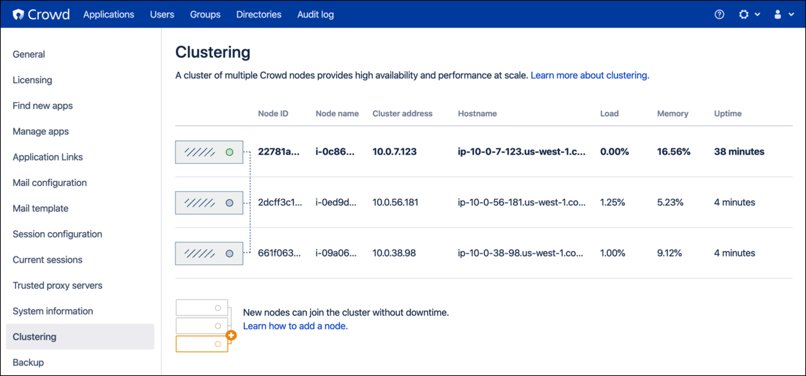

== Configuring {partner-product-name}

When you launch the Quick Start, it deploys a single {partner-product-name-short} node (Auto Scaling group of `min=1` and `max=1`). The following procedure will focus on setting up a brand new {partner-product-name} deployment.

include::./_config_application.adoc[]

== Adding nodes to the {partner-product-name} cluster

.	Sign in to the AWS Management Console, use the Region selector in the navigation bar to choose the AWS Region for your deployment, and open the AWS CloudFormation console at https://console.aws.amazon.com/cloudformation/.
.	Choose the {partner-product-name} stack. From the *Actions* list, choose *Update Stack*.
.	On the *Select Template* page, leave *Use current template* selected, and then choose *Next*.
.	On the *Specify Details* page, in the *{partner-product-name-short} Setup* section of *Parameters*, enter the desired number of cluster nodes in *Minimum number of cluster nodes* and *Maximum number of cluster nodes*, then click through to update the stack. This will set a static number of nodes in your cluster.
. After the stack finishes updating, verify the number of nodes in your {partner-product-name} cluster. Choose *Clustering* again from the administration console sidebar. The following example shows a cluster scaled up to three instances.
+

// == Best practices for using {partner-product-name} on AWS
// Provide post-deployment best practices for using the technology on AWS, including considerations such as migrating data, backups, ensuring high performance, high availability, etc. Link to software documentation for detailed information.

// _Add any best practices for using the software._

// == Security
// Provide post-deployment best practices for using the technology on AWS, including considerations such as migrating data, backups, ensuring high performance, high availability, etc. Link to software documentation for detailed information.

// _Add any security-related information._

// == Other useful information
//Provide any other information of interest to users, especially focusing on areas where AWS or cloud usage differs from on-premises usage.

// _Add any other details that will help the customer use the software on AWS._
