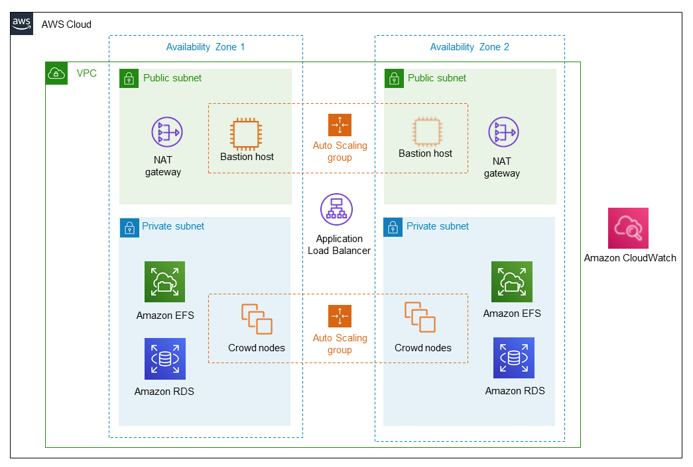

Deploying this Quick Start for a new https://aws.amazon.com/quickstart/architecture/{partner-company-name}-standard-infrastructure/[{vpc-name} (ASI)] with default parameters builds the following {partner-product-name-short} environment in the AWS Cloud.

// Replace this example diagram with your own. Send us your source PowerPoint file. Be sure to follow our guidelines here : http://(we should include these points on our contributors giude)
[#architecture1]
.Quick Start architecture for {partner-product-name-short} on AWS

As shown in figure 1, the Quick Start sets up the following:

* A highly available architecture that spans two Availability Zones.
* In the public subnets:
** A network address translation (NAT) gateway to allow outbound internet access for resources in the private subnets.
** A bastion host that enables secure access to {partner-product-name-short} without exposing it to the internet. For more information, see https://docs.aws.amazon.com/quickstart/latest/linux-bastion/architecture.html#bastion-hosts[Bastion Hosts]). You can choose not to provision a bastion host if you prefer to access {partner-product-name-short} nodes through the https://docs.aws.amazon.com/systems-manager/latest/userguide/session-manager.html[AWS Systems Manager].
* In the private subnets:
** Amazon Elastic File System (Amazon EFS) to store artifacts such as attachments, avatars, icons, import and export files, and plug-ins in a common location that can be accessed by all {partner-product-name-short} nodes.
** Amazon Relational Database Service (Amazon RDS) for PostgreSQL in a high availability (Multi-AZ) configuration, which mitigates failover if the master node fails.
* Amazon Elastic Compute Cloud (Amazon EC2) Auto Scaling groups for scaling the bastion hosts in the public subnets and the {partner-product-name-short} nodes in the private subnets. The instances are based on Amazon Linux, a Linux server operating system from AWS, and use an Atlassian-provided Amazon Machine Image (AMI).
* An Application Load Balancer, which works both as a load balancer and a Secure Sockets Layer (SSL) termination reverse proxy.
* Amazon CloudWatch for basic monitoring of all application and database nodes in your deployment. By default, CloudWatch collects and stores logs from each monitored node. Amazon CloudWatch is an optional component.

=== Auto Scaling groups in this Quick Start

This Quick Start uses https://docs.aws.amazon.com/autoscaling/ec2/userguide/AutoScalingGroup.html[Auto Scaling groups] to statically control the number of its nodes. Don't use Auto Scaling to dynamically scale the size of your cluster. Adding an application node to the cluster usually takes more than 20 minutes, which isn't fast enough to address sudden load spikes.

If you can identify periods of high and low loads, you can schedule the application node cluster to scale accordingly. For more information, see https://docs.aws.amazon.com/autoscaling/ec2/userguide/schedule_time.html[Scheduled Scaling for Amazon EC2 Auto Scaling].

To study trends in your organization's load, be sure to monitor the performance of your deployment.
