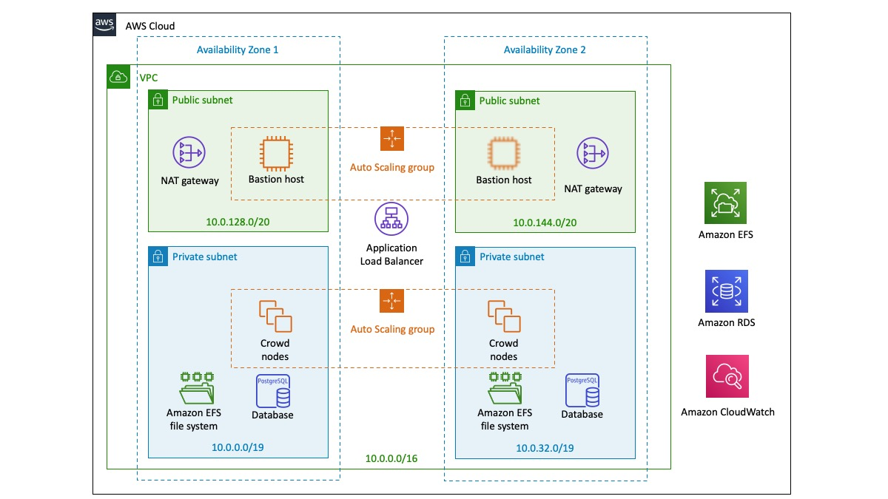

Deploying this Quick Start for a new https://aws.amazon.com/quickstart/architecture/{partner-company-name}-standard-infrastructure/[{vpc-name} (ASI)] with *default parameters* builds the following _{partner-product-name}_ environment in the AWS Cloud.

// Replace this example diagram with your own. Send us your source PowerPoint file. Be sure to follow our guidelines here : http://(we should include these points on our contributors giude)
[#architecture1]
.Quick Start architecture for _{partner-product-name}_ on AWS

This Quick Start includes two AWS CloudFormation templates: the first one builds the {vpc-name} (ASI), which is a virtual private cloud (VPC) that contains the components required by all {partner-company-name} Data Center applications, and then provisions {partner-product-name} into this ASI. The second template provisions {partner-product-name} in an existing ASI.

The resulting infrastructure from this Quick Start includes the following:

* *Amazon RDS for PostgreSQL*: Amazon RDS for PostgreSQL in a Multi-AZ configuration allows failover in the event the master node fails.
* *Amazon EFS*: {partner-product-name} uses a shared file system to store artifacts like attachments, avatars, icons, import/export files, and plugins in a common location that is accessible to all {partner-product-name-short} nodes. The Quick Start architecture implements the shared file system by using the highly available Amazon Elastic File System (Amazon EFS) service.
* *{partner-product-name-short} Auto Scaling group*: {partner-product-name} is installed on Amazon Elastic Compute Cloud (Amazon EC2) instances in an Auto Scaling group. The Quick Start uses Ansible playbooks to configure {partner-product-name} on each instance. See the https://bitbucket.org/atlassian/dc-deployments-automation/src/master/README.md[Atlassian Data Center Installation Automation (repo)] for more details.
* *Application Load Balancer*: This works both as a load balancer and a Secure Sockets Layer (SSL) termination reverse proxy.

=== Optional Components

This infrastructure also includes the following optional components:

* *Bastion host*: This host enables secure access to your {partner-product-name-short} nodes without exposing it to the internet (for more information, see https://docs.aws.amazon.com/quickstart/latest/linux-bastion/architecture.html#bastion-hosts[Bastion Hosts]). You can choose not to provision a Bastion host if you prefer to access {partner-product-name-short} nodes through the https://docs.aws.amazon.com/systems-manager/latest/userguide/session-manager.html[AWS Systems Manager Sessions Manager].
* *Amazon CloudWatch*: This provides basic monitoring for all application and database nodes in your deployment. By default, CloudWatch will also collect and store logs from each monitored node. You can choose not to provision Amazon CloudWatch if you plan to use a different monitoring platform.

=== Auto Scaling Groups in this Quick Start

This Quick Start uses https://docs.aws.amazon.com/autoscaling/ec2/userguide/AutoScalingGroup.html[Auto Scaling groups], but only to statically control the number of its nodes. We don't recommend that you use Auto Scaling to dynamically scale the size of your cluster. Adding an application node to the cluster usually takes more than 20 minutes, which isn't fast enough to address sudden load spikes.

If you can identify any periods of high and low load, you can schedule the application node cluster to scale accordingly. For more information, see https://docs.aws.amazon.com/autoscaling/ec2/userguide/schedule_time.html[Scheduled Scaling for Amazon EC2 Auto Scaling].

To study trends in your organization's load, you'll need to monitor the performance of your deployment.
